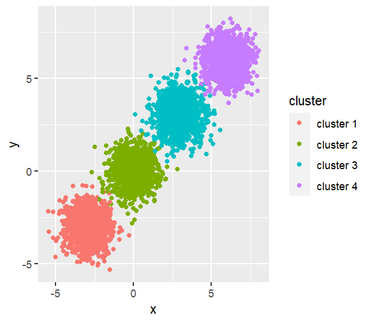

```{r setup, include=FALSE}
knitr::opts_chunk$set(echo = TRUE)
```

# Background and Objective

Latent Class Analysis and K-means are two successful clustering algorithms that partition the given data into distinct subgroups where observations in each group are very similar. They are popular choice of method in solving healthcare research problems such as identifying clusters on microscopic images [@amin_recognition_2015], categorizing suicides by risk factors [@logan_suicide_2011], and grouping elderly patients with their access to health care [@thorpe_patterns_2011]. One important assumption that both of these algorithms require is the normality of the given data. 

In our project, we focus on the unsupervised learning scenario and we investigate how well these two algorithms perform when the normality assumption is violated. We designed 4 simulation settings as violation of the normality assumption: 1) skewed data, 2) data with heavy tail, 3) data with outliers, 4) multimodal data. In the end, we compare their performance with Rand Index in each settings with varying sample sizes.

# Statistical Method

## K Means

K-means clustering is a popular clustering algorithm that partitions data into a prespecified number of clusters. The goal of k-means is to find clusters such that the total within-cluster variation is minimized.

$$add\ equation$$
There are four steps to the k-means algorithm. (1) Specify number of clusters $k$. (2) Assign each observation to their closest centroid, minimizing $W(C_k)$. (3) For each cluster, update the cluster centroid by calculating the new mean values of all the data points in the cluster. The centroid of a $K_{th}$ cluster is a vector of length $p$ containing the means of all variables. (4) Iteratively minimize the total within sum of square. That is, iterate steps 3 and 4 until the cluster assignments stop changing or the maximum number of iterations is reached.

There are multiple ways to determine the optimal number of clusters for k-means. In this project, we use the average silhouette method. This method chooses the optimal number of clusters $k$ that maximized the average silhouette.

## Latent Class Analysis

LCA is a model-based clustering approach that derives clusters using a Gaussian finite mixture modeling that describes distribution the data. We use the R package $\textbf{mclust}$ for this task which allows a wide range of parameterizations of the data.

LCA uses finite mixture modeling for parameter estimation, which is crucial to determining the number of components.

# Performance Metric

We use the Rand index as our performance metric in this study. It is used to compare the similarity of results between two different clustering methods. In our case, we compare our k-means or LCA clustering results to the true clustering that we have defined through our data generation.

Given a set of $n$ elements $S = \{o_1, \dots, o_n\}$ and two partitions of S to compare, $X = \{X_1, \dots, X_r\}$, and $Y = \{Y_1, \dots, Y_s\}$ we denote $a$ as the number of times a pair of elements belongs to the same cluster across two clustering methods. And we denote $b$ as the number of times a pair of elements belong to different clusters across the two methods. Finally, the Rand index is

\begin{equation*}
R = \frac{a+b}{{2 \choose n}},
\end{equation*}

which measures the proportion of agreement of two clustering methods in all unordered pairs.

# Simulations Settings and Results

In simulations, we consider bivariate data with 2 true clusters. We generated data from different non-elliptical distributions in each setting. 

For each simulation setting, we create 100 runs using randomly generated data sets in size of 500, 1000, 5000 and evaluate the Rand index for each method.


## Skewed Data - Data Generation

In this setting, we want to test the performance of K-means and LCA when all features follow a skewed distribution. We assume the features $X_1, X_2$ are independent.

All data in the first feature $X_{11}, X_{12},..X_{1N}$ are random draws from a mixture model of Weibull distributions with density $0.5f_1(x|1,5) + 0.5f_2(x|12,14)$ where $f_1 \sim Weibull(1,5)$ and $f_2 \sim Weibull (12,14)$.

Similarly, all data in the second feature $X_{21}, X_{22},..X_{2N}$ are random draws from another mixture model of Weilbull distributions with density $0.5f_3(x|1,3) + 0.5f_4(x|1,4)$ where $f_3 \sim Weibull(1,3)$ and $f_4 \sim Weibull (1,4)$.

We generate 2 equal-sized clusters with total size being 500, 1000 and 5000. An example of a sample with size 5000 is shown below. 

{width=400px}

## Skewed Data - Results

We are interested in how well K-means and LCA perform when the input data already has two true clusters. We calculate Rand Index for sample data in each simulation run and conclude that after 100 simulations, K-means performs better than LCA across all sample sizes. As sample size increases, the variance of Rand Index decreases. 

{width=400px}

To investigate some potential reasons behind this, we compare the optimal number of cluster number for each method in all simulations. Choosing the optimal cluster number is the first step for both methods. This number is crucial to our comparison because we predetermined the number of true clusters to be 2 and Rand Index uses the number of agreements in its calculation. Therefore, having a cluster number that is larger than 2 could hurt the performance. 

In this figure, we compare the optimal number of clusters. Overall, K-means choose its optimal number of cluster around 3 which is much lower than that of LCA across all sample sizes. As sample size increases, the optimal number of cluster increases for LCA as well. 

{width=400px}
\newpage

## Multimodal Data - Data Generation

In this setting, we have two independent variables $X$ and $Y$, which both follow the same bimodal mixture distribution. Variables $X$ and $Y$ can each be partitioned into two parts, $\{X_1, X_2\}$ and $\{Y_1, Y_2\}$, where $X_1$, $Y_1$ are drawn from one bimodal distribution and $X_2$, $Y_2$ are drawn from a different bimodal distribution, as specified below.

\begin{align*}
  X_1, Y_1 & \sim 
  \begin{cases}
    N(-3, \frac{3}{4}) & w/\ prob.\ 0.5 \\
    N(0, \frac{3}{4}) & w/\ prob.\ 0.5
  \end{cases} \\
  X_2, Y_2 & \sim
  \begin{cases}
    N(3, \frac{3}{4}) & w/\ prob.\ 0.5 \\
    N(6, \frac{3}{4}) & w/\ prob.\ 0.5
  \end{cases}
\end{align*}

Since each bimodal distribution is a mixture of two Gaussian distributions, these data follow a Gaussian mixture distribution, leading to four distinct latent clusters. This can be seen in the figure below, which graphs an example dataset on X and Y axes and colors the data points by cluster.




Since this is a mixture Gaussian case, we should expect LCA to perform very well since it assumes mixture Gaussian data. K-mean should also perform well, since k-means is proven to identify cluster in normal data well.

## Multimodal Data - Results

We found that the median Rand index for 100 runs using k-means with sample size $n=500$ was 0.99 (IQR: 0.17) while for LCA it was 1 (IQR: 0). For sample size was $n=1000$ the median Rand index for k-means was 0.99 (IQR: 0.25) and for LCA it was 1 (IQR: 0). For sample size $n=5000$ the median Rand index for k-means was 1 (IQR: 0) and it was the same for LCA. These results are visualized below and show that k-means and LCA both perform almost perfectly in this case, with LCA performing better when the sample size is smaller. Variation from a Rand index of 1 (i.e., perfect classification) comes in only when k-means or LCA algorithms do not choose the correct number of clusters initially.


# Discussion

## Conclusion

In conclusion, we found that for skewed data, k-means performs better than LCA. However, in all other cases, LCA outperformed k-means, except in the case where the data follows a Gaussian mixture distribution and the sample size of the dataset is very large, in which case k-means and LCA perform similarly.

## Limitations

In this study, we found that there is no uniformly best algorithm for identifying latent clusters in data. This leads us to believe that knowing how the data is generated is important for deciding whether to use k-means or LCA. However, this information is rarely known.

We also found that variation in correct classification for both algorithms often comes from choosing the number of clusters. There are many ways to choose the number of clusters before actually performing the clustering algorithm. Varying these methods goes beyond the scope of this study, but future research should test k-means against LCA under different cluster number selection techniques.

In summation, we suggest that researchers make informed speculations about the shape and potential number of latent clusters in their data before running either k-means or LCA in order to get the best results.

# References

<div id="refs"></div>


